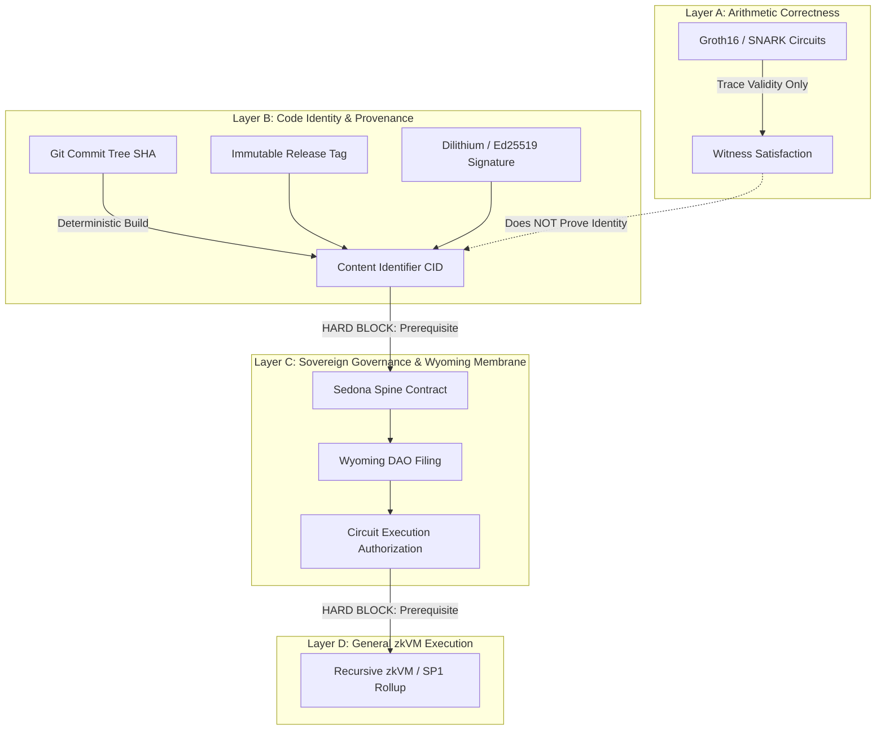

# ADR-008: Zero-Knowledge Code Verification, Layer Separation, and Sovereign Identity

- **Status:** Proposed (Constitutional Gate — Gated on Layer-B Materialization)
- **Layer-B State:** Missing (Immutable Git Tag + CID not yet anchored on disk)
- **Date:** 2026-08-22
- **Owners:** Legal + Sedona Spine Steward, Formal Methods Steward
- **Tags:** #zk-proofs, #layer-separation, #code-identity, #wyoming-membrane, #sedona-spine, #crmf-ace
- **Cross-Cutting:** Blocks Layer C Authorization, Wyoming DAO Filings, and Layer D zkVM

---

## 1. Context and Problem Statement

A critical architectural conflation occurs when zero-knowledge proofs (e.g., Groth16 / Plonk SNARKs) of execution trace validity are erroneously treated as **proofs of code identity**. 

- **Groth16 / ZK-SNARKs prove statement satisfiability** for an arithmetic circuit over a finite field: $\exists w \text{ s.t. } C(x, w) = 1$. They do **not** bind the source repository state, compiler toolchain, or human/autonomous provenance to the binary.
- Without an immutable, content-addressed Layer-B identity, downstream governance cannot distinguish between an authorized circuit running under audited constraints and an adversarial circuit proving an identical constraint system.
- Under the **Wyoming Decentralized Unincorporated Nonprofit Association (DUNA) / DAO Membrane**, residual human discretionary authority is forbidden. Autonomous legal personhood requires cryptographic determinism.

---

## 2. Decision: Strict Four-Layer Separation (A / B / C / D)

We establish strict architectural decoupling across four orthogonal layers, enforcing sequential gating:



### 2.1 Layer Breakdown & Gate Specifications

| Layer | Responsibility | Verification Mechanism | Non-Negotiable Invariants |
| :--- | :--- | :--- | :--- |
| **Layer A** | **Trace Arithmetic** | Groth16 / Plonk ZK-SNARK | Proves constraint satisfiability $C(x, w) = 1$. **MUST NOT** be claimed as code identity. |
| **Layer B** | **Code Identity & Provenance** | Immutable Git Tag + CID (IPFS/Git Tree) + PQC Signature | Content-addressed cryptographic binding of source, dependency lockfiles, and compiler toolchain. |
| **Layer C** | **Governance & Wyoming Membrane** | Smart Contract Attestation / Sedona Spine | Enforces statutory and algorithmic compliance. **Layer B is a mandatory blocking prerequisite.** |
| **Layer D** | **Recursive zkVM Rollup** | zkVM (SP1 / RISC Zero) | General execution rollups. **Strictly blocked until Layers B and C are verified and active.** |

---

## 3. Enforcement Rules & Invariants

1. **Layer B Blocks Layer C and Wyoming Filing:**
   - No new quantum circuit, MA-VQE pulse schedule, or legal filing under the Wyoming membrane may proceed without a resolved Layer-B CID and signed Git release tag.
   - Groth16 proofs presented without Layer-B content addressing are rejected at the ALP gate (`ERR_LAYER_B_IDENTITY_MISSING`).
2. **Zero Residual Human Authority:**
   - All state transitions in Layer C must be triggered by machine-verified witnesses (`PhaseMirror.ADR`, `sedona_spine` engine, and `AttestationRegistry`).
3. **No Layer D Until B & C Exist:**
   - Any deployment of Layer-D zkVM recursive proofs is suspended until Layer-B code identity and Layer-C governance membranes are locked in production.

---

## 4. Consequences

### Positive
- **Eliminates False Identity Claims:** Prevents false reliance on Groth16 proofs for supply chain and codebase integrity.
- **Constitutional Alignment:** Enforces strict adherence to the Sedona Spine zero-drift mandate and Wyoming statutory requirements.
- **Deterministic Provenance:** Every executed circuit is bijectively linked to a specific git commit, toolchain version, and Dilithium signature.

### Negative / Operational Constraints
- **Release Gating:** Increases release overhead by requiring explicit CID anchoring and cryptographic tagging prior to any operational circuit deployment.

---

## 5. Security & Verification Gate

```bash
# Automated CI Enforcement (Layer-B Gate)
test -n "${RELEASE_GIT_TAG}" || { echo "FAIL: Layer-B git tag required"; exit 1; }
test -n "${CODEBASE_CID}" || { echo "FAIL: Layer-B CID required"; exit 1; }
python scripts/validate_layer_b_witness.py --tag "${RELEASE_GIT_TAG}" --cid "${CODEBASE_CID}"
```
